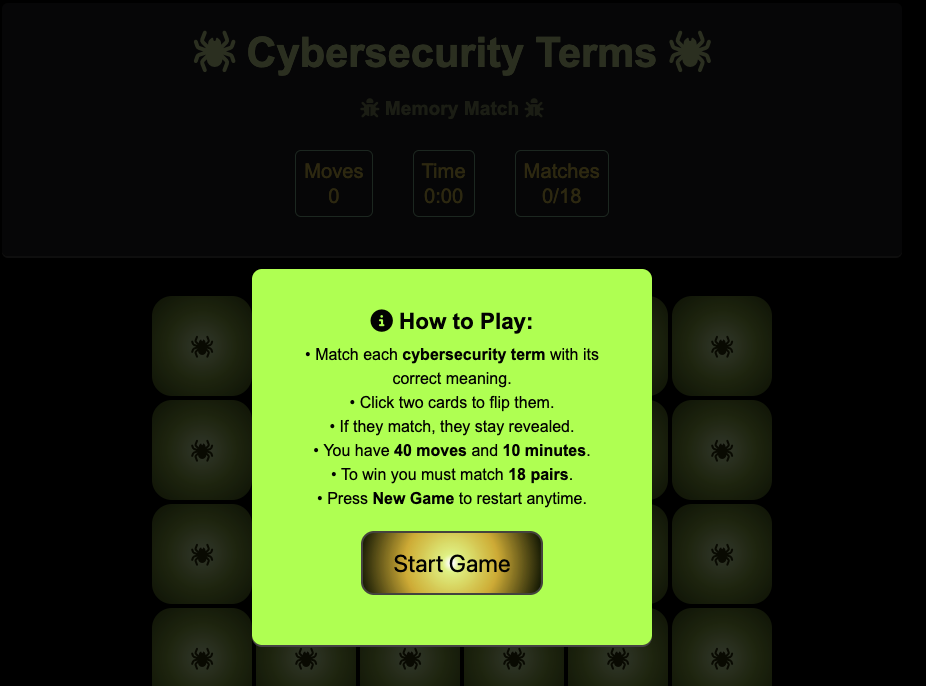
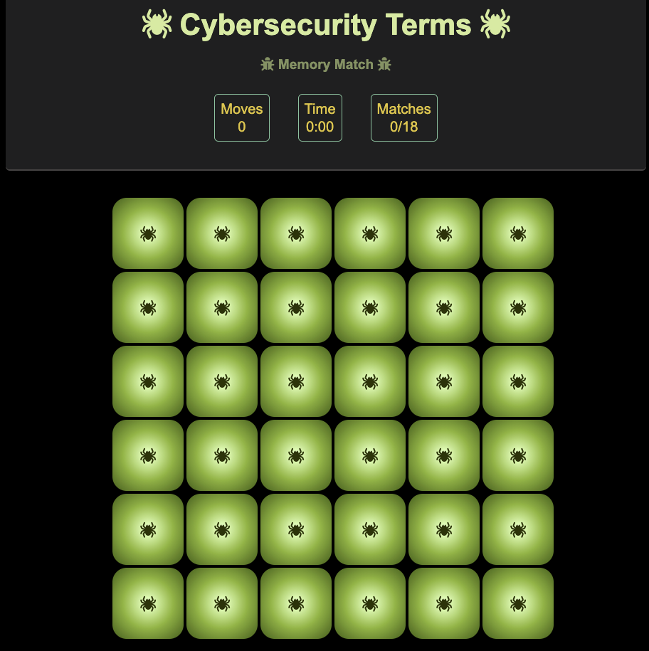
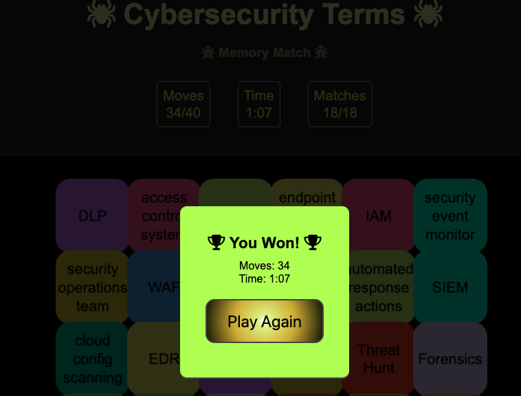

# Cybersecurity Terms – Memory Match Game
---
## START

 

---
## PLAY

---
## END

---

A browser-based matching game built with HTML, CSS, and JavaScript.

**Live Game:**  
https://angelikakasia.github.io/game-memory-cards/

**GitHub Repo:**  
https://github.com/angelikakasia/game-memory-cards

**Planning Folder:**
https://github.com/angelikakasia/game-memory-cards/tree/main/planning

---

## I. My WHY Behind the Game

I created a Cybersecurity Terms Memory Match Game to improve my focus and reinforce cybersecurity vocabulary.

The game contains 36 total cards arranged in a 6×6 grid, which form **18 matching pairs** (each pair = a term + its meaning).

### Gameplay Overview 
- Match each **cybersecurity term** with its correct meaning  
- Click two cards to flip them  
- If they match, they stay revealed  
- You must match **18 pairs** to win  
- You have **40 moves** and **10 minutes**  
- Press **New Game** to restart anytime

---

## II. Pseudocode

### 1. Game Setup
- Create 18 matching pairs: a term and a meaning  
- Duplicate them → 36 total cards  
- Assign each pair a matching background color  
- Shuffle the cards  
- Render them into a 6×6 grid  
- Set timer (10 minutes) and move limit (40 moves)

### 2. When the Player Clicks a Card
- If card is already matched or face-up → ignore  
- Otherwise flip card  
- Store flipped card in temporary list  

### 3. When Two Cards Are Flipped
- Lock the board  
- Compare the two cards  
- If matching:
  - Mark as “matched”
  - Increase matched-pairs count
  - If all 18 matched → display “You Won”
- If not matching:
  - Wait 1 second
  - Flip both back
- Unlock the board  

### 4. Restarting the Game
- Reset matched pairs, moves, and time  
- Flip all cards face-down  
- Shuffle again  
- Re-render the board  

---

## III. **Variables and Data Types**

1. List of all cards  
   Type: array of objects  
   Purpose: stores term, meaning, color, id  

2. Shuffled game board  
   Type: array  
   Purpose: randomized order of cards  

3. Flipped cards  
   Type: array (max length 2)  
   Purpose: holds two currently flipped cards  

4. Matched cards  
   Type: number  
   Purpose: tracks matched pairs  

5. Game lock state  
   Type: boolean  
   Purpose: prevents clicks during comparison  

6. Card elements (DOM)  
   Type: element references  
   Purpose: rendering updates  

7. Restart button  
   Type: element reference  
   Purpose: resets game state  

8. Game status  
   Type: string / boolean  
   Purpose: “in progress”, “won”, or “reset”

---

## IV. **Additional Planning Requirements**

### 1. Game Board Layout
- 6×6 grid  
- All cards identical when face-down  
- When flipped, show:
  - Term or meaning  
  - Pair’s pastel background color  

### 2. Game Logic
- Prevent multiple flips during match check  
- Track:
  - flipped cards  
  - matched cards  
  - move count  
  - remaining pairs  
- Reset fully clears and reshuffles  

### 3. Event Listeners + Functions
- Card click → flip  
- Restart click → reset  
- Functions handle:
  - initialize  
  - shuffle  
  - render  
  - flip  
  - compare  
  - update game state  
  - show win modal  

---

## Technologies Used (Raw)
- HTML  
- CSS  
- JavaScript  
- Git / GitHub Pages  

---

## Next Steps
- Add sound effects  
- Add difficulty levels  
- Add different games with different topics  
- Add scoreboard  
- Add themes and animations  
- Add accessibility modes  

---

## Attributions
Font Awesome Free 6.4.0  
Icons used under the Font Awesome Free License.  
CDN Source: https://cdnjs.cloudflare.com/ajax/libs/font-awesome/6.4.0/css/all.min.css  
Font Awesome Website: https://fontawesome.com  

